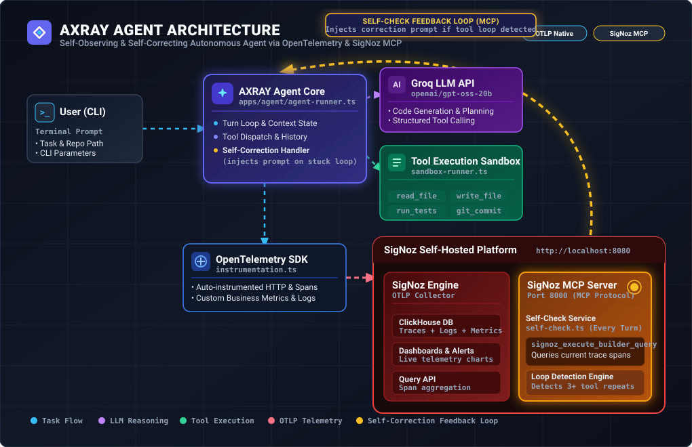

# AXRAY Agent

> An autonomous coding agent that observes itself. Built for the **Agents of SigNoz** hackathon by [WeMakeDevs](https://www.wemakedevs.org/hackathons/signoz) x [SigNoz](https://signoz.io).

AXRAY is a CLI coding agent — give it a task and a repo, and it reads code, edits files, runs tests, and (optionally) commits and pushes changes. What makes it different: **it is fully instrumented with OpenTelemetry, and it queries its own telemetry through the SigNoz MCP server mid-run to detect and correct stuck loops.** If you can't observe your AI agents, you don't own them — AXRAY observes itself.

---

## Table of Contents

- [How it works](#how-it-works)
- [Key features](#key-features)
- [Tech stack](#tech-stack)
- [Project structure](#project-structure)
- [Prerequisites](#prerequisites)
- [Setup: self-hosted SigNoz](#setup-self-hosted-signoz)
- [Setup: the agent](#setup-the-agent)
- [Running the agent](#running-the-agent)
- [Observability](#observability)
- [Dashboards](#dashboards)
- [Alerts](#alerts)
- [The self-check loop (MCP in action)](#the-self-check-loop-mcp-in-action)
- [Reproducing this deployment (for judges)](#reproducing-this-deployment-for-judges)
- [Troubleshooting](#troubleshooting)

---

## How it works

<p align="center">
  
</p>

### Execution Workflow

1. **User Trigger**: The developer passes a task prompt and repository path via CLI (`axray --task "..." --dir .`).
2. **Core Agent Loop**: `agent-runner.ts` manages the turn loop, system prompt context, and turn history.
3. **LLM Reasoning & Tool Execution**: The agent sends prompts to Groq LLM (`openai/gpt-oss-20b`) and dispatches sandboxed tool calls (`read_file`, `write_file`, `run_tests`, `git_commit`).
4. **OTLP Telemetry Streaming**: `instrumentation.ts` automatically captures HTTP spans, logs, and business metrics, exporting them via OTLP gRPC/HTTP to self-hosted **SigNoz** (port `8080`).
5. **Self-Correction Feedback Loop (SigNoz MCP)**: At every turn, `self-check.ts` queries the **SigNoz MCP Server** (port `8000`) via `signoz_execute_builder_query`. If a tool-call loop or repeated failure is detected in active session traces, a system-level correction message is dynamically injected to break the loop.

<details>
<summary>🔍 <b>View Interactive Mermaid Architecture Diagram</b></summary>

```mermaid
graph TD
    classDef user fill:#0f172a,stroke:#38bdf8,stroke-width:2px,color:#fff
    classDef agent fill:#1e1b4b,stroke:#6366f1,stroke-width:2px,color:#fff
    classDef llm fill:#3b0764,stroke:#a855f7,stroke-width:2px,color:#fff
    classDef tool fill:#064e3b,stroke:#10b981,stroke-width:2px,color:#fff
    classDef otel fill:#0f172a,stroke:#3b82f6,stroke-width:2px,color:#fff
    classDef signoz fill:#450a0a,stroke:#ef4444,stroke-width:2px,color:#fff
    classDef mcp fill:#78350f,stroke:#f59e0b,stroke-width:2.5px,color:#fff

    User["💻 <b>User (CLI)</b><br/><code>axray --task '...'</code>"] :::user
    Agent["🧠 <b>AXRAY Agent Core</b><br/><code>agent-runner.ts</code>"] :::agent
    LLM["⚡ <b>Groq LLM API</b><br/><code>openai/gpt-oss-20b</code>"] :::llm
    Tools["🛠️ <b>Tool Execution Sandbox</b><br/><code>read_file</code> | <code>write_file</code><br/><code>run_tests</code> | <code>git_commit</code>"] :::tool
    OTel["📡 <b>OpenTelemetry SDK</b><br/><code>instrumentation.ts</code>"] :::otel
    SigNoz["🔥 <b>SigNoz Platform</b><br/>ClickHouse Traces/Logs/Metrics"] :::signoz
    MCP["🐝 <b>SigNoz MCP Server</b><br/><code>self-check.ts</code> (Every Turn)"] :::mcp

    User -->|Task & Repo Path| Agent
    Agent <-->|Prompts & Tool Calls| LLM
    Agent -->|Execute Actions| Tools
    Agent -->|Spans & Custom Metrics| OTel
    Tools -->|Span Traces| OTel
    OTel -->|OTLP Stream| SigNoz
    SigNoz --- MCP
    MCP -->|<b>Self-Correction Feedback Loop</b><br/>Detects repeated tool loops &amp; injects correction prompt| Agent
```

</details>

## Key features

- **Self-correcting agent** — `self-check.ts` runs after every turn, queries SigNoz's MCP server (`signoz_execute_builder_query`) for repeated `tool.call` spans in the current session, and if a loop is detected, injects a system-level correction message that redirects the LLM.
- **Full-stack OpenTelemetry instrumentation** — traces, logs, and metrics, all exported over OTLP to a self-hosted SigNoz instance. No third-party SaaS, no cloud dependency.
- **Custom business metrics** — token usage, run counts, error counts — alongside auto-instrumented HTTP calls (Groq API, MCP server) via `@opentelemetry/auto-instrumentations-node`.
- **Sandboxed execution** — code edits and test runs happen in an isolated workspace (`sandbox-runner.ts`), with diffs captured (`diff-capture.ts`) before any commit.
- **Git integration** — on success, the agent can auto-commit and push its changes to a branch (`github-commit.ts`).

## Tech stack

| Layer | Choice |
|---|---|
| Language | TypeScript / Node.js |
| LLM | Groq (`openai/gpt-oss-20b` via `groq-sdk`) |
| Agent protocol | MCP (`@modelcontextprotocol/sdk`) |
| Observability | OpenTelemetry SDK → SigNoz (self-hosted via Foundry) |
| Deployment | Docker Compose, provisioned by SigNoz Foundry (`foundryctl`) |

## Project structure

```
apps/agent/
├── src/
│   ├── index.ts            # CLI entrypoint (commander) — starts telemetry, parses --task/--dir/--model
│   ├── agent-runner.ts      # Core agent loop: LLM calls, tool dispatch, turn management
│   ├── instrumentation.ts   # OpenTelemetry SDK setup: traces, logs, metrics, custom counters
│   ├── self-check.ts        # Queries SigNoz MCP for stuck-loop detection + self-correction
│   ├── sandbox-runner.ts    # Executes tool actions in an isolated workspace
│   ├── diff-capture.ts      # Captures file diffs before/after agent edits
│   ├── github-commit.ts     # Auto-commit/push on successful runs
│   └── tools/                # Individual tool implementations (read/edit/run_tests, etc.)
├── test-fixture/            # Sample repo with intentionally failing tests, used for demos
├── Dockerfile
└── package.json
deploy/
├── casting.yaml              # Foundry config used to provision SigNoz (reproducible deployment)
├── casting.yaml.lock         # Locked/rendered Foundry state
├── dashboards/                # Exported SigNoz dashboard JSON
└── alerts/                    # Exported SigNoz alert rules JSON
```

## Prerequisites

- Node.js 24+ and npm
- Docker Engine 20.10+ with the Compose v2 plugin, and **at least 4GB** allocated to Docker
- A [Groq API key](https://console.groq.com)
- Linux, macOS, or WSL2 (this project was built and tested on Zorin OS / Ubuntu)

## Setup: self-hosted SigNoz

We self-host SigNoz using [Foundry](https://github.com/SigNoz/foundry), the official CLI for provisioning the SigNoz stack as code.

### 1. Install `foundryctl`

```bash
curl -fsSL https://signoz.io/foundry.sh | bash
export PATH="$HOME/.local/bin:$PATH"   # add to ~/.bashrc to persist
```

### 2. Deploy SigNoz with MCP enabled

The `deploy/casting.yaml` in this repo already has the MCP server enabled:

```yaml
apiVersion: v1alpha1
kind: Installation
metadata:
  name: signoz
spec:
  deployment:
    flavor: compose
    mode: docker
  mcp:
    spec:
      enabled: true
```

```bash
cd deploy
foundryctl cast -f casting.yaml
```

This pulls the required images, generates Compose files under `pours/deployment/`, and starts:
- SigNoz UI on `:8080`
- OTLP ingestion on `:4317` / `:4318`
- SigNoz MCP server on `:8000`

### 3. Verify

```bash
docker ps
```

Open `http://localhost:8080` and create your admin account.

### 4. Everyday start/stop (after the first deploy)

You do **not** need to re-run `foundryctl cast` every time. Just start/stop the containers:

```bash
# Start
cd deploy/pours/deployment && docker compose up -d

# Stop (data persists)
docker compose down
```

### 5. Create a service account + API key

**Settings → Service Accounts → New Service Account**, then generate an API key from it. **Grant it a role (e.g. Admin)** — service accounts have no permissions by default, and the MCP self-check queries will fail with `403 authz_forbidden` until a role is assigned.

## Setup: the agent

```bash
cd apps/agent
npm install
```

Create a `.env` file in `apps/agent/`:

```env
# Groq
GROQ_API_KEY=your-groq-key

# OpenTelemetry export — leave unset to default to http://localhost:4318 (local SigNoz)
# OTLP_ENDPOINT=
# SIGNOZ_REGION=

# SigNoz MCP self-check
SIGNOZ_MCP_ENDPOINT=http://localhost:8000/mcp
SIGNOZ_MCP_API_KEY=your-signoz-service-account-key
SIGNOZ_INSTANCE_URL=http://signoz-signoz-0:8080
```

> **Why `signoz-signoz-0` and not `localhost` for `SIGNOZ_INSTANCE_URL`?** The MCP server itself runs inside Docker. From inside a container, `localhost` refers to the container, not your host machine — so the MCP server can't reach SigNoz's API through it. `signoz-signoz-0` is the SigNoz backend's Docker-internal hostname on the `signoz-network`, which the MCP container *can* resolve. `SIGNOZ_MCP_ENDPOINT`, by contrast, is called from your host machine (the agent process), so `localhost:8000` is correct there.

## Running the agent

```bash
npm run dev -- --task "Fix the failing tests" --dir ./test-fixture --verbose
```

Or use the built-in fixture shortcut:

```bash
npm run test:fixture:setup   # installs the fixture's own deps once
npm run test:fixture:run     # runs the agent against the fixture
```

CLI options:

| Flag | Description | Default |
|---|---|---|
| `--task` | The task for the agent to perform (required) | — |
| `--dir` | Path to the target repo/workspace | current directory |
| `--model` | Groq model to use | `openai/gpt-oss-20b` |
| `--max-turns` | Max LLM turns before stopping | `30` |
| `--commit` | Auto-commit changes on success | `false` |
| `--push-branch` | Branch to push to on success | — |

## Observability

Every run of AXRAY emits, over OTLP to SigNoz:

**Traces** (`service.name = axray-agent`)
- `agent.session` — one span per full run, with `session.task`, `session.model`, `session.files_changed_count`, `session.has_changes`
- `agent.turn` — one span per LLM turn, `turn.number`
- `llm.call` — one span per Groq API call, with `gen_ai.system`, `gen_ai.request.model`, `gen_ai.usage.input_tokens`, `gen_ai.usage.output_tokens`, `llm.cost_usd`, `llm.latency_ms`
- `tool.call` — one span per tool invocation, `tool.name`, `tool.args`, `tool.result_status`
- `agent.self_check` — one span per self-check pass, `self_check.mcp_tool_used`, `self_check.triggered_correction`
- Auto-instrumented HTTP spans for calls to `api.groq.com` and the SigNoz MCP server (via `@opentelemetry/instrumentation-undici`)

**Logs** — all `console.log/info/warn/error` output is captured and shipped as structured OTel logs alongside the run.

**Metrics** — custom counters:
- `agent.runs.total`
- `agent.errors.total`
- `agent.tokens.input.total`
- `agent.tokens.output.total`

Plus host metrics (CPU, memory) via `@opentelemetry/host-metrics`.

## Dashboards

We import and adapt SigNoz's official [Groq dashboard template](https://signoz.io/docs/dashboards/dashboard-templates/groq-dashboard/), rewired from OpenInference/Traceloop attribute names to the OpenTelemetry GenAI semantic conventions this project actually emits (`gen_ai.usage.input_tokens`, `gen_ai.request.model`, etc.), filtered to `name = 'llm.call'`.

The exported dashboard JSON is in `deploy/dashboards/`. To import:

1. **Dashboards → New Dashboard → Import JSON**
2. Upload `deploy/dashboards/axray-groq-dashboard.json`
3. Run the agent to generate live data


## Alerts

We use all four SigNoz alert signal types — Traces, Metrics, Logs, and Exceptions — to cover reliability, cost, performance, and integration health end to end. Exported rule definitions (all 14) live in deploy/alerts/axray-alert-rules.json, and can be recreated on a fresh instance with deploy/alerts/import-alerts.sh (see Reproducing this deployment).

Trace-based (9)
#	Alert	Filter	Condition	Severity	Purpose
1	Session Failure	name = 'agent.session' AND status_code = 2	count > 0 / 5m	critical	Catch failed agent runs
2	Self-Correction Triggered	name = 'agent.self_check' AND self_check.triggered_correction = true	count > 0 / 5m	warning	Confirms the self-correction feature is firing
3	LLM Cost Threshold	sum(llm.cost_usd) where name = 'llm.call'	> $0.05 / 15m	warning	Cost control
4	Groq API Errors	server.address = 'api.groq.com' AND http.response.status_code >= 400	count > 0 / 5m	warning	Upstream API reliability (e.g. rate limits)
5	Slow Turn Detected	p95(duration_nano) where name = 'agent.turn'	> 20s / 5m	warning	Performance regressions
6	MCP Self-Check Fallback	name = 'agent.self_check' AND self_check.mcp_tool_used = 'local_turn_log_fallback'	count > 0 / 5m	info	MCP integration health
7	No Activity Detected	name = 'agent.session'	below 1 / 1h	info	Dead-man's switch — fires when the agent goes silent
8	Approaching Turn Limit	name = 'agent.turn' AND turn.number >= 25	count > 0 / 5m	warning	Flags tasks nearing the --max-turns cap (default 30)
9	Tool Execution Failed	name = 'tool.call' AND tool.result_status != 'success'	count > 0 / 5m	warning	Catches failing tool calls (edit/test/etc.)
Metric-based (3)
#	Alert	Metric	Condition	Severity	Purpose
10	Error Counter Spike	agent.errors.total	count > 0 / 5m	critical	Fires on the custom error counter — see note below on querying it
11	Token Burn Spike	agent.tokens.input.total (rate)	above baseline / 5m	warning	Catches abnormal token consumption
12	High CPU Usage	system.cpu.utilization (host metric)	> 80% / 5m	warning	Host resource pressure
Log-based (1)
#	Alert	Filter	Condition	Severity	Purpose
13	Error Logs Detected	service.name = 'axray-agent' AND severity_text = 'ERROR'	count > 0 / 5m	warning	Any structured ERROR-level log line
Exceptions-based (1)
#	Alert	Filter	Condition	Severity	Purpose
14	Uncaught Exception	service.name = 'axray-agent'	count > 0 / 5m	critical	Unhandled Node.js exceptions, auto-captured by OTel

Note on custom metric names: instrumentation.ts defines counters with dotted names (agent.errors.total, agent.tokens.input.total, ...). SigNoz's Query Builder metric picker didn't surface these by name — they only appear once at least one data point has been exported (i.e. after the code path that calls .add() has actually run at least once). The reliable way to reference them in an alert is via the PromQL tab, where OTel's Prometheus-compatible naming converts dots to underscores (e.g. agent_errors_total).

The self-check loop (MCP in action)

After every turn, self-check.ts does the following:

Connects to the SigNoz MCP server over Streamable HTTP (@modelcontextprotocol/sdk)
Calls the signoz_execute_builder_query tool with a Query Builder v5 payload, counting tool.call spans for the current session.id in the last 5 minutes
Cross-references this with an in-memory turn log to detect if the same tool has been called with identical arguments 3+ times
If a loop is detected, it injects a correction message into the LLM's context:

"⚠️ SYSTEM ALERT (Self-Correction Triggered): You have retried the exact action X with arguments Y N times. STOP repeating this action..."

All of this — the query, the result, the decision — is itself traced as an agent.self_check span

If the MCP call fails for any reason (network, auth, schema mismatch), it falls back gracefully to local turn-log analysis (self_check.mcp_tool_used = 'local_turn_log_fallback') rather than crashing the run — which is exactly what Alert 6 monitors.

Reproducing this deployment (for judges)
bash
# 1. Install foundryctl
curl -fsSL https://signoz.io/foundry.sh | bash

# 2. Deploy SigNoz from the checked-in casting file
cd deploy
foundryctl cast -f casting.yaml

# 3. Create a service account + API key in the SigNoz UI, assign it a role

# 4. Import the dashboard
#    Dashboards → New Dashboard → Import JSON → deploy/dashboards/axray-groq-dashboard.json

# 5. Import all 14 alert rules
cd deploy/alerts
SIGNOZ_API_KEY=<your-service-account-key> ./import-alerts.sh

# 6. Set up the agent
cd ../../apps/agent
npm install
# fill in .env with your Groq key + the SigNoz service account key

# 7. Run it
npm run test:fixture:run

Traces, logs, metrics, and (if triggered) self-correction events will appear in SigNoz within seconds. Some alerts (self-correction, error counter, exceptions) will only fire under specific conditions and won't show data on a first, error-free run — that's expected, see the Alerts section.

Troubleshooting
service.name shows as unknown_service:node — in instrumentation.ts, Resource.merge() gives priority to the argument, not the base. Make sure defaultResource().merge(resourceFromAttributes({...})) is the order (custom attributes last).
MCP host not allowed error — the MCP server runs in Docker; SIGNOZ_INSTANCE_URL must use the Docker-internal hostname of the SigNoz backend container (e.g. signoz-signoz-0), not localhost.
MCP missing start or end timestamp — the query payload must use the full v5 Query Builder shape (start, end, requestType, compositeQuery), not the older filters/aggregateOperator shorthand.
MCP 403 authz_forbidden — the service account has no role assigned. Assign one in Settings → Service Accounts.
Docker permission denied — after sudo usermod -aG docker $USER, you need a fresh shell session (newgrp docker or re-login) for group membership to apply.