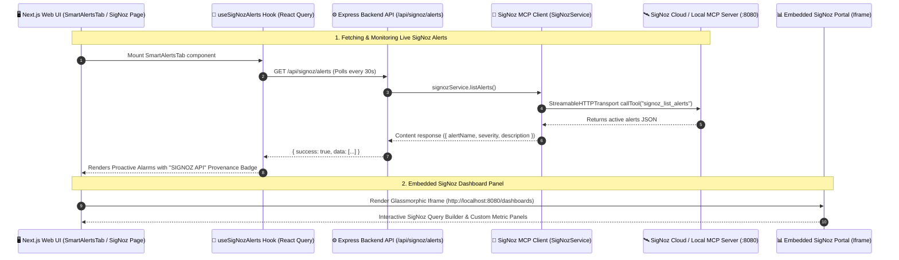
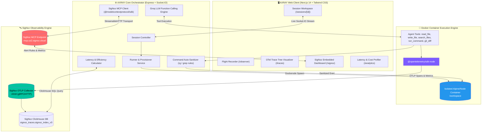
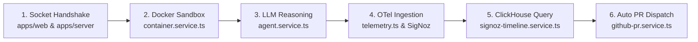

<div align="center">

# 🛰️ AXRAY — The AI Agent Flight Recorder & Telemetry Engine

### *If you can't observe your AI coding agents, you don't own them.*

**An Open-Source, OpenTelemetry-Native AI Agent Orchestrator & Observability Platform Powered by SigNoz**

[](https://opentelemetry.io/)
[](https://signoz.io/)
[](https://modelcontextprotocol.io/)
[](https://nextjs.org/)
[](https://nodejs.org/)
[](https://www.docker.com/)
[](LICENSE)

[Architecture](#-system-architecture) • [SigNoz Alerts & Dashboards](#-signoz-alerts--embedded-dashboard-architecture) • [Hero Feature: Time-in-Brain](#-the-hero-feature-time-in-brain-vs-time-in-environment) • [ClickHouse Engine](#-signoz-deep-integration--clickhouse-engine) • [Guided Code Tour](#-guided-architecture--code-tour) • [Quickstart](#-quickstart)

---

</div>

## 🏆 Hackathon Spotlight: Why AXRAY Wins "Agents of SigNoz"

Autonomous AI coding agents operate as non-deterministic state machines: they parse prompts, generate reasoning tokens, execute shell commands inside containers, inspect repository diffs, and self-correct. When an agent turns slow, costs explode, or it gets trapped in an infinite retry loop, standard logging fails.

**AXRAY** solves this by turning every agent turn into a structured **OpenTelemetry Trace Tree**, storing telemetry in **SigNoz ClickHouse**, fetching live alert rules via the **SigNoz Model Context Protocol (MCP)**, and providing an embedded SigNoz dashboard with real-time financial, latency, and system execution observability.

```
┌──────────────────────────────────────────────────────────────────────────────────────────────────┐
|                                     AXRAY TELEMETRY DASHBOARD                                    |
├──────────────────────────────────────────────────────────────────────────────────────────────────┤
|  Session: #sess_9f82  │ Model: Llama-3.3-70b  │ Container: docker://axray-ws-42  │ Status: ACTIVE |
├──────────────────────────────────────────────────────────────────────────────────────────────────┤
|  ⏱️ LATENCY PROFILE                                                                               |
|  ├── 🧠 Time-in-Brain (LLM Reasoning):         2,450ms (78%) [Tokens: 14,200 | Cost: $0.0083]     |
|  └── ⚡ Time-in-Environment (Docker System):     680ms (22%) [Commands: 4  | ExitCode: 0]      |
|  ─────────────────────────────────────────────────────────────────────────────────────────────── |
|  🚨 SIGNOZ MCP ALERTS: 1 Critical Alert Active (Cost Spike > $0.05 / Agent Loop Flagged)          |
|  🎯 Efficiency Score: 88/100  │  Primary Bottleneck: LLM Context Window & Token Overhead         |
└──────────────────────────────────────────────────────────────────────────────────────────────────┘
```

---

## 🚨 SigNoz Alerts & Embedded Dashboard Architecture

AXRAY integrates directly with SigNoz to surface live alert rules, monitor system anomalies, and render custom metrics panels seamlessly inside the UI without context-switching.



---

### 1. 🔔 How SigNoz Alerts Work & How to Fetch Them

AXRAY fetches alert rules directly from your SigNoz instance using the **SigNoz Model Context Protocol (MCP)** server:

#### Backend: MCP Tool Execution (`apps/server/src/services/signoz.service.ts`)
The server uses `@modelcontextprotocol/sdk` and `StreamableHTTPClientTransport` to invoke `signoz_list_alerts`:

```typescript
// GET /api/signoz/alerts Handler
export async function listAlerts() {
  const mcpUrl = process.env.SIGNOZ_INSTANCE_URL || "https://mcp.us2.signoz.cloud";
  const apiKey = process.env.SIGNOZ_MCP_API_KEY || process.env.SIGNOZ_API_KEY;

  const transport = new StreamableHTTPClientTransport(new URL(mcpUrl), {
    requestInit: {
      headers: {
        "SIGNOZ-API-KEY": apiKey,
        "X-SigNoz-URL": new URL(mcpUrl).origin,
      },
    },
  });

  const client = new Client({ name: "axray-server", version: "1.0.0" });
  await client.connect(transport);

  // Invoke SigNoz MCP alert listing tool
  const result = await client.callTool({
    name: "signoz_list_alerts",
    arguments: {},
  });

  return result;
}
```

#### Express API Route (`apps/server/src/controllers/signoz.controller.ts`)
Exposes the endpoint to the web application:
```typescript
// GET /api/signoz/alerts
export const getSigNozAlerts = async (req: Request, res: Response) => {
  try {
    const data = await signozService.listAlerts();
    res.json({ success: true, data });
  } catch (error) {
    res.status(500).json({ success: false, error: String(error) });
  }
};
```

#### Frontend Hook (`apps/web/features/sessions/hooks/useSigNozAlerts.ts`)
Uses React Query to fetch alerts and automatically refresh them every 30 seconds:
```typescript
import { useQuery } from '@tanstack/react-query';

const fetchSigNozAlerts = async () => {
  const res = await fetch(`${process.env.NEXT_PUBLIC_API_URL || 'http://localhost:3001'}/api/signoz/alerts`);
  if (!res.ok) throw new Error('Failed to fetch SigNoz alerts');
  const json = await res.json();
  return json.data?.content || [];
};

export const useSigNozAlerts = () => {
  return useQuery({
    queryKey: ['signoz-alerts'],
    queryFn: fetchSigNozAlerts,
    refetchInterval: 30000, // Refresh every 30s
  });
};
```

#### Proactive Alerts Component (`apps/web/features/sessions/components/SmartAlertsTab.tsx`)
Merges real SigNoz alerts with local agent execution heuristics:
- 🚨 **SigNoz MCP Custom Alerts:** Active monitor rules from SigNoz (e.g. *Agent Retry Loop*, *System Memory Threshold*).
- 💰 **Cost Spike Anomaly:** Triggers when total session LLM cost exceeds `$0.01`.
- 🔢 **Token Spike Anomaly:** Triggers when total token consumption exceeds `10,000 tokens`.

---

### 2. 📊 Embedded SigNoz Dashboard Panel

AXRAY embeds the complete SigNoz Query Builder & Dashboard directly within the session workspace at `/sessions/[id]/signoz`:

#### Page Route (`apps/web/app/(app)/(workspace)/sessions/[id]/signoz/page.tsx`)
```tsx
export default function SigNozDashboardPage() {
  return (
    <div className="flex-1 w-full bg-surface-container-lowest border border-outline-variant/30 rounded-3xl overflow-hidden relative">
      {/* Interactive SigNoz Dashboard Iframe */}
      <iframe
        src="http://localhost:8080/dashboards" // Local SigNoz port 8080
        className="w-full h-full border-0"
        title="SigNoz Dashboard"
        sandbox="allow-same-origin allow-scripts allow-popups allow-forms"
      />
    </div>
  );
}
```

#### Fetching Custom Query Metrics via MCP (`signoz_execute_builder_query`)
In addition to the iframe, AXRAY calls SigNoz's query builder API programmatically:
```typescript
// Execute Query Builder via MCP for Logs, Traces, or Metrics
const result = await client.callTool({
  name: "signoz_execute_builder_query",
  arguments: {
    query: {
      dataSource: "metrics", // "logs" | "traces" | "metrics"
      aggregateOperator: "rate",
      filters: [],
      limit: 10,
    },
    start: Date.now() - 15 * 60 * 1000, // Last 15 minutes
    end: Date.now(),
  },
});
```

---

## ⚡ The Hero Feature: "Time-in-Brain" vs "Time-in-Environment"

Agents operate in two distinct modes:
1. **Time-in-Brain (LLM Reasoning):** Wait time spent generating tokens, evaluating context windows, and emitting function call parameters.
2. **Time-in-Environment (System Execution):** Time spent running bash commands, installing npm dependencies, querying git diffs, and writing files inside the Docker container.

### Latency Segregation & Efficiency Scoring Formula

AXRAY parses the OpenTelemetry span tree in real-time to compute the segregation ratio and calculate an **Efficiency Score (0–100)**:

$$\text{Total Latency } (T_{\text{total}}) = T_{\text{Brain}} + T_{\text{Env}}$$

$$\text{Brain \%} = \left(\frac{T_{\text{Brain}}}{T_{\text{total}}}\right) \times 100 \quad , \quad \text{Env \%} = 100 - \text{Brain \%}$$

$$\text{Efficiency Score} = \max\left(45, \min\left(98, 100 - (0.35 \times \text{Brain \%} + 0.10 \times \text{Env \%})\right)\right)$$

```mermaid
gantt
    title Agent Turn #3 Latency Breakdown (Span Duration Timeline)
    dateFormat  X
    axisFormat %s ms

    section LLM Inference (Brain)
    Groq API Token Stream :active, brain1, 0, 2450

    section Container Execution (Environment)
    Docker Exec: search_files  :crit, env1, 2450, 2750
    Docker Exec: write_file    :crit, env2, 2750, 2900
    Docker Exec: git diff      :crit, env3, 2900, 3130
```

---

## 🏗️ System Architecture

AXRAY is structured as a high-performance TypeScript monorepo with an Express orchestrator, a Next.js 14 glassmorphic frontend, a Docker container provisioner, and a dual SigNoz telemetry pipeline (OTLP + MCP).



---

## 🛰️ SigNoz Deep Integration & ClickHouse Engine

AXRAY interacts with SigNoz on two distinct operational planes:

### Direct ClickHouse Telemetry Queries
To render sub-millisecond trace timelines without API overhead, AXRAY executes native SQL directly against SigNoz's ClickHouse storage engine (`signoz_traces.signoz_index_v3`):

```sql
-- Fetching Span Trees filtered by AXRAY Session Run ID
SELECT 
    spanID, 
    traceID, 
    name, 
    hasError, 
    timestamp, 
    durationNano, 
    attributes_string, 
    attributes_number 
FROM signoz_traces.signoz_index_v3 
WHERE attributes_string['axray.run.id'] = 'run_9f8b7a6c' 
ORDER BY timestamp ASC 
FORMAT JSON;
```

```sql
-- Tool Execution Performance & Latency Aggregation
SELECT 
    attributes_string['tool.name'] AS toolName, 
    avg(durationNano) AS avgDurationNano, 
    max(durationNano) AS maxDurationNano, 
    count() AS executionCount 
FROM signoz_traces.signoz_index_v3 
WHERE name = 'tool.call' AND attributes_string['axray.session.id'] = 'sess_42' 
GROUP BY toolName 
ORDER BY avgDurationNano DESC 
FORMAT JSON;
```

---

## 🗺️ Guided Architecture & Code Tour

Explore the lifecycle of an agent execution request across the codebase:



### Step 1: Real-Time Handshake & Session Creation
- **Client Component:** [SessionHeader.tsx](file:///home/hussain/Documents/axray-signoz/apps/web/features/sessions/components/SessionHeader.tsx)
- **Socket Emitter:** [socket.emitter.ts](file:///home/hussain/Documents/axray-signoz/apps/server/src/sockets/socket.emitter.ts)
- User prompts trigger a WebSocket session creation event, establishing live bi-directional streaming between client and backend.

### Step 2: Sandboxed Docker Container Provisioning
- **Service:** [container.service.ts](file:///home/hussain/Documents/axray-signoz/apps/server/src/services/container.service.ts)
- Dockerode provisions an isolated container with mounted workspace volumes. Incoming terminal search commands (`grep`, `rg`) pass through an **Auto-Sanitizer** that automatically injects exclusion flags (`--exclude-dir=node_modules`, `--exclude-dir=.git`).

### Step 3: LLM Reasoning & Tool Calling Loop
- **Service:** [agent.service.ts](file:///home/hussain/Documents/axray-signoz/apps/server/src/services/agent.service.ts)
- Groq LLM evaluates the prompt across bounded turns (max 25). Tools (`read_file`, `write_file`, `search_files`, `run_command`, `git_diff`) are dispatched directly into the Docker sandbox.

### Step 4: OpenTelemetry Instrumentation & OTLP Export
- **Lib:** [telemetry.ts](file:///home/hussain/Documents/axray-signoz/apps/server/src/lib/telemetry.ts)
- Spans are enriched with `AXRAY_ATTRIBUTES` and exported asynchronously via `@opentelemetry/sdk-node` to the SigNoz OTLP Collector on `:4318`.

### Step 5: ClickHouse Latency Aggregation & Real-Time Analytics
- **Service:** [signoz-timeline.service.ts](file:///home/hussain/Documents/axray-signoz/apps/server/src/services/signoz-timeline.service.ts)
- AXRAY queries SigNoz's ClickHouse instance to parse span trees, calculate **Time-in-Brain vs Time-in-Environment**, and render trace visualizations in the UI.

### Step 6: Automated GitHub Pull Request Creation
- **Service:** [github-pr.service.ts](file:///home/hussain/Documents/axray-signoz/apps/server/src/services/github-pr.service.ts)
- Once the task completes, AXRAY inspects uncommitted git changes inside the container (`git status --porcelain`), pushes a topic branch to GitHub, and opens a Pull Request automatically.

---

## 🛡️ OpenTelemetry GenAI Semantic Conventions

AXRAY strictly follows standard OpenTelemetry GenAI & Process semantic conventions:

| Attribute Key | Type | Example Value | Description |
| :--- | :--- | :--- | :--- |
| `axray.session.id` | `string` | `"sess_9f82a1b3"` | Correlates all runs under a session |
| `axray.run.id` | `string` | `"run_42"` | Unique identifier for a single task execution |
| `axray.phase` | `string` | `"llm"` \| `"tool"` \| `"git"` | Current lifecycle execution phase |
| `gen_ai.system` | `string` | `"groq"` | Target LLM provider |
| `gen_ai.request.model` | `string` | `"openai/gpt-oss-20b"` | Exact model identifier |
| `gen_ai.usage.input_tokens` | `int` | `14200` | Prompt token count for turn |
| `gen_ai.usage.output_tokens`| `int` | `850` | Generated completion token count |
| `gen_ai.usage.total_tokens` | `int` | `15050` | Total turn token overhead |
| `axray.tool.name` | `string` | `"search_files"` | Name of function tool invoked |
| `axray.tool.exit_code` | `int` | `0` | Return code of executed container process |
| `container.id` | `string` | `"7f8a9b0c1d2e"` | Target Docker container ID |

---

## 🚀 Quickstart Guide

### Prerequisites
- **Node.js**: `>= 20.0.0`
- **Docker**: Running locally (Docker Desktop or Docker Engine)
- **SigNoz**: Running locally (`http://localhost:8080`) with OTLP receiver on port `4318`
- **MongoDB**: Local instance (`mongodb://localhost:27017/axray`) or MongoDB Atlas
- **Groq API Key**: Free key from [Groq Console](https://console.groq.com/)

---

### Step 1: Clone Repository

```bash
git clone https://github.com/hussainjamal760/axray-signoz.git
cd axray-signoz
```

---

### Step 2: Environment Configuration

Create `apps/server/.env`:

```env
PORT=3001
MONGO_URI=mongodb://localhost:27017/axray
FRONTEND_URL=http://localhost:3000
GROQ_API_KEY=gsk_your_groq_api_key_here
SIGNOZ_INSTANCE_URL=http://localhost:8080
SIGNOZ_API_KEY=your_signoz_api_key_here
SIGNOZ_MCP_API_KEY=your_signoz_api_key_here
OTEL_EXPORTER_OTLP_ENDPOINT=http://localhost:4318
```

Create `apps/web/.env.local`:

```env
NEXT_PUBLIC_API_URL=http://localhost:3001
NEXT_PUBLIC_SIGNOZ_URL=http://localhost:8080
```

---

### Step 3: Install Monorepo Dependencies

```bash
npm install
```

---

### Step 4: Launch Monorepo Services

Run frontend client and backend server concurrently:

```bash
npm run dev
```

Service URLs:
- 📱 **AXRAY Dashboard:** `http://localhost:3000`
- ⚙️ **AXRAY Server API:** `http://localhost:3001`
- 📊 **SigNoz Observability UI:** `http://localhost:8080`

---

## 🧪 Verification & Health Checks

Run these diagnostic commands to verify your setup:

1. **Verify SigNoz OTLP gRPC/HTTP Receiver:**
   ```bash
   curl -I http://localhost:4318/v1/traces
   ```
   *Expected:* HTTP response indicating the OTLP port is open.

2. **Verify SigNoz ClickHouse Container:**
   ```bash
   docker exec -it signoz-telemetrystore-clickhouse-0-0 clickhouse-client --query "SHOW DATABASES;"
   ```
   *Expected:* Output contains `signoz_traces`.

3. **Verify AXRAY Backend Health:**
   ```bash
   curl http://localhost:3001/api/health
   ```

---

## 📁 Monorepo Structure & Feature Domains

```text
axray-signoz/
├── apps/
│   ├── server/                         # Express Backend & Telemetry Orchestrator
│   │   ├── src/
│   │   │   ├── controllers/            # Agent runs, Sessions, GitHub PR, SigNoz MCP
│   │   │   ├── services/               # Agent LLM engine, Docker container, ClickHouse timeline
│   │   │   ├── sockets/                # Socket.IO event emitters & handlers
│   │   │   ├── lib/                    # OTel SDK setup, Dockerode, GitHub Octokit
│   │   │   └── models/                 # Mongoose schemas (Session, AgentRun)
│   └── web/                            # Next.js 14 Glassmorphic Client
│       ├── app/                        # App Router (/sessions, /traces, /signoz, /analytics)
│       └── features/                   # Feature-sliced components & custom hooks
├── package.json                        # Root workspace configuration
└── README.md                           # Master Documentation
```

---

<div align="center">

### 🤝 Built with passion for the WeMakeDevs × SigNoz "Agents of SigNoz" Hackathon

*Made by [Team Cipher].*

</div>