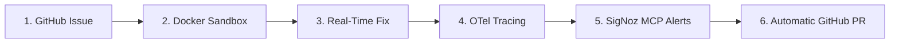
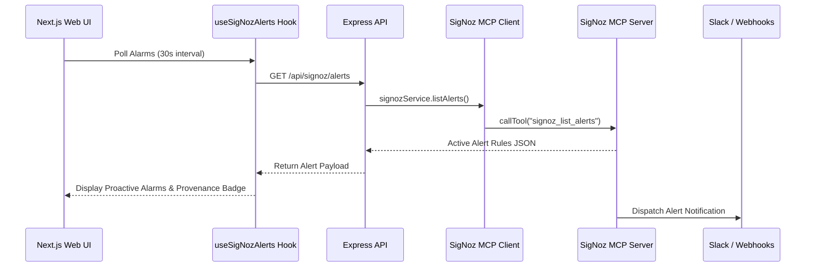
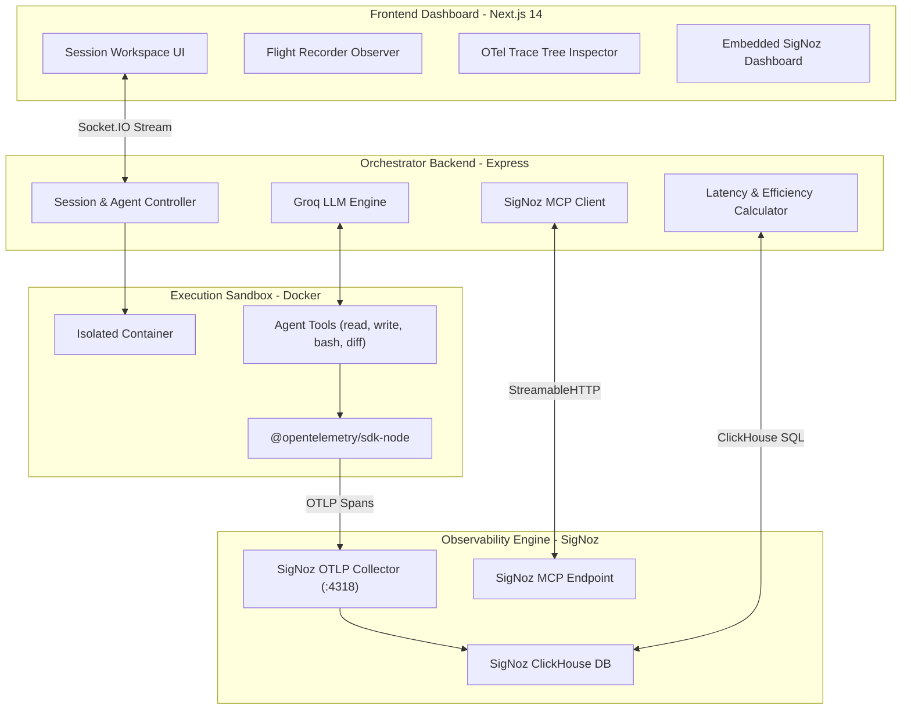

<div align="center">

# 🛰️ AXRAY — The AI Agent Flight Recorder & Telemetry Engine

### *If you can't observe your AI coding agents, you don't own them.*

**An Open-Source, OpenTelemetry-Native AI Agent Orchestrator & Observability Platform Powered by SigNoz**

[](https://opentelemetry.io/)
[](https://signoz.io/)
[](https://modelcontextprotocol.io/)
[](https://nextjs.org/)
[](https://www.docker.com/)
[](LICENSE)

[TL;DR Pitch](#-tldr--30-second-elevator-pitch) • [Autonomous Workflow](#-the-autonomous-ai-developer-workflow) • [Time-in-Brain](#-the-hero-feature-time-in-brain-vs-time-in-environment) • [SigNoz Integration](#-signoz-alerts--embedded-dashboard) • [Quickstart](#-quickstart)

---

</div>

## ⚡ TL;DR — 30-Second Elevator Pitch

> [!IMPORTANT]
> **Why AXRAY Wins "Agents of SigNoz":**
> AXRAY transforms SigNoz from a passive monitoring tool into an **autonomous AI engineering platform**:
> - 🤖 **End-to-End CLI Developer:** Ingests GitHub Issues ➔ Executes fixes in Docker ➔ Traces turns in OTel ➔ Alerts Slack ➔ Opens GitHub PRs.
> - ⏱️ **"Time-in-Brain" vs "Time-in-Environment":** Segregates LLM reasoning latency from container command execution with an automated **Efficiency Score (0–100)**.
> - 🚨 **Native SigNoz MCP Integration:** Connects to SigNoz via Model Context Protocol (`signoz_list_alerts`, `signoz_execute_builder_query`) for live alert streaming and query building.
> - 🐳 **Sandboxed Security & OTel Tracing:** Runs commands safely inside Docker while instrumenting every turn with OpenTelemetry GenAI semantic conventions.

---

## 🤖 The Autonomous AI Developer Workflow

AXRAY operates as a fully autonomous CLI developer backed by OpenTelemetry observability:



1. **🐙 GitHub Ingestion:** Ingests repository branches, issues, and prompt requirements.
2. **🔒 Docker Execution Sandbox:** Spawns isolated, non-root containers with automatic command sanitization (`grep`, `rg` exclusions).
3. **⚡ Autonomous Code Resolution:** LLM agent inspects code, runs unit tests, refactors files, and verifies execution.
4. **🛰️ OpenTelemetry Instrumentation:** Exports structured OTLP gRPC/HTTP trace trees directly to SigNoz.
5. **🔔 SigNoz MCP Alerts & Slack Integration:** Surfaces active monitor rules and routes real-time alarms to Slack channels.
6. **🚀 Automatic Pull Request Creation:** Pushes topic branches and opens GitHub PRs with markdown summaries automatically.

---

## ⚡ The Hero Feature: "Time-in-Brain" vs "Time-in-Environment"

Agents spend time in two distinct phases:
1. **Time-in-Brain (LLM Reasoning):** Time spent generating tokens and evaluating prompt contexts.
2. **Time-in-Environment (System Execution):** Time spent running bash commands, installing packages, and reading files inside Docker.

### Latency Segregation & Efficiency Scoring Formula

$$\text{Total Latency } (T_{\text{total}}) = T_{\text{Brain}} + T_{\text{Env}}$$

$$\text{Efficiency Score} = \max\left(45, \min\left(98, 100 - (0.35 \times \text{Brain \%} + 0.10 \times \text{Env \%})\right)\right)$$

```mermaid
gantt
    title Agent Turn Latency Breakdown
    dateFormat X
    axisFormat %s ms

    section LLM Inference (Brain)
    Groq LLM Reasoning Stream :active, brain1, 0, 2450

    section Container Execution (Environment)
    Docker Exec - search_files :crit, env1, 2450, 2750
    Docker Exec - write_file   :crit, env2, 2750, 2900
    Docker Exec - git diff     :crit, env3, 2900, 3130
```



---

## 🚨 SigNoz Alerts & Embedded Dashboard

AXRAY features a dual-layer SigNoz integration: **Live MCP Alert Synchronization** and an **Embedded SigNoz Dashboard**.



### 1. 🔔 MCP Alert Streaming & Proactive Alarms
- Connects to SigNoz using `@modelcontextprotocol/sdk` and `StreamableHTTPClientTransport`.
- Invokes `signoz_list_alerts` and `signoz_execute_builder_query` to surface live alerts and custom metrics inside the AXRAY UI.
- Combines SigNoz rules with dynamic anomaly detectors (*Cost Spike > $0.01*, *Token Spike > 10,000*).

### 2. 📊 Embedded Glassmorphic Dashboard
- Embeds your self-hosted SigNoz portal (`http://localhost:8080/dashboards`) directly inside the session workspace iframe at `/sessions/[id]/signoz`.

---

## 🏗️ System Architecture



---

## 🗺️ Guided Architecture & Code Tour

- 🐙 **Session & Socket Handshake:** [SessionHeader.tsx](apps/web/features/sessions/components/SessionHeader.tsx) & [socket.emitter.ts](apps/server/src/sockets/socket.emitter.ts)
- 🔒 **Docker Container Sandbox & Command Sanitizer:** [container.service.ts](apps/server/src/services/container.service.ts)
- ⚡ **LLM Function Calling Engine:** [agent.service.ts](apps/server/src/services/agent.service.ts)
- 🛰️ **OpenTelemetry OTLP Instrumenter:** [telemetry.ts](apps/server/src/lib/telemetry.ts)
- 🔔 **SigNoz MCP Service:** [signoz.service.ts](apps/server/src/services/signoz.service.ts) & [useSigNozAlerts.ts](apps/web/features/sessions/hooks/useSigNozAlerts.ts)
- 📊 **ClickHouse Trace Timeline:** [signoz-timeline.service.ts](apps/server/src/services/signoz-timeline.service.ts)
- 🚀 **Automated GitHub PR Creation:** [github-pr.service.ts](apps/server/src/services/github-pr.service.ts)

---

## 🛡️ OpenTelemetry GenAI Semantic Conventions

| Attribute Key | Type | Example Value | Description |
| :--- | :--- | :--- | :--- |
| `axray.session.id` | `string` | `"sess_9f82a1b3"` | Correlates all runs under a session |
| `axray.run.id` | `string` | `"run_42"` | Task execution ID |
| `gen_ai.system` | `string` | `"groq"` | Target LLM provider |
| `gen_ai.request.model` | `string` | `"openai/gpt-oss-20b"` | Model identifier |
| `gen_ai.usage.input_tokens` | `int` | `14200` | Prompt token count |
| `gen_ai.usage.output_tokens`| `int` | `850` | Completion token count |
| `axray.tool.name` | `string` | `"search_files"` | Invoked tool function |
| `axray.tool.exit_code` | `int` | `0` | Container process exit code |

---

## 🚀 Quickstart Guide

### 1. Clone & Configure

```bash
git clone https://github.com/hussainjamal760/axray-signoz.git
cd axray-signoz
```

Create `apps/server/.env`:
```env
PORT=3001
MONGO_URI=mongodb://localhost:27017/axray
FRONTEND_URL=http://localhost:3000
GROQ_API_KEY=gsk_your_groq_api_key
SIGNOZ_INSTANCE_URL=http://localhost:8080
SIGNOZ_API_KEY=your_signoz_api_key
OTEL_EXPORTER_OTLP_ENDPOINT=http://localhost:4318
```

Create `apps/web/.env.local`:
```env
NEXT_PUBLIC_API_URL=http://localhost:3001
NEXT_PUBLIC_SIGNOZ_URL=http://localhost:8080
```

### 2. Install & Launch

```bash
npm install
npm run dev
```

- 📱 **AXRAY Dashboard:** `http://localhost:3000`
- ⚙️ **AXRAY API:** `http://localhost:3001`
- 📊 **SigNoz UI:** `http://localhost:8080`

---

## 🧪 Judge's Evaluation Guide (Zero-Friction Local Setup)

To evaluate AXRAY locally with full SigNoz capabilities (Dashboards & Alerts), follow these simple steps to spin up SigNoz on your machine. **No manual dashboard configuration required!**

### Prerequisites
- **Docker Engine 20.10+** (Allocate at least 4GB RAM)
- *Windows Users:* We highly recommend using Docker natively inside WSL 2 to prevent ClickHouse crashes.
- **Node.js v18+**

### Step 1: Install `foundryctl` (SigNoz Manager)
SigNoz uses `foundryctl` to manage its microservices. Open your terminal and install it:
```bash
# macOS, Linux, or Windows WSL
curl -sL https://signoz.io/install.sh | bash
```

### Step 2: Clone AXRAY & Deploy SigNoz
We have a pre-configured `casting.yaml` that sets up SigNoz specifically for AXRAY's AI telemetry.
```bash
git clone https://github.com/hussainjamal760/axray-signoz.git
cd axray-signoz

# Launch SigNoz locally (takes 3-5 mins to pull images)
foundryctl cast --file deploy/casting.yaml
```
*Wait until SigNoz is fully up and running on `http://localhost:8080` before proceeding to Step 3.*

### Step 3: Inject AXRAY Dashboards & Alerts
Instead of manually importing JSON files, run our automated injection script. This will use Postgres injection to instantly attach our custom dashboards and alert rules to your local SigNoz instance.
```bash
# Inside the axray-signoz directory
npm install
node deploy/import-signoz-local.js
```

### Step 4: Run AXRAY
Now launch the AXRAY backend and frontend:
```bash
npm run dev
```
Open **`http://localhost:3000`** in your browser. Start an agent session, and watch the traces and alerts stream live into your local SigNoz instance!

---

<div align="center">

### 🤝 Built by Team Cipher for the WeMakeDevs × SigNoz "Agents of SigNoz" Hackathon

*Developed with ❤️ by **Team Cipher***

</div>