<div align="center">

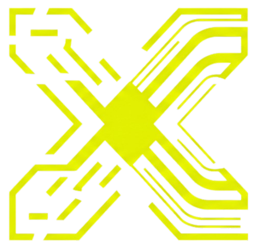

# AXRAY — The AI Agent Flight Recorder & Telemetry Engine

### *If you can't observe your AI coding agents, you don't own them.*

**An Open-Source, OpenTelemetry-Native AI Agent Orchestrator & Observability Platform Powered by SigNoz**

[](https://opentelemetry.io/)
[](https://signoz.io/)
[](https://modelcontextprotocol.io/)
[](https://nextjs.org/)
[](https://www.docker.com/)
[](LICENSE)

### 🌐 [**Live Demo: axray-signoz-web.vercel.app**](https://axray-signoz-web.vercel.app/)

[TL;DR Pitch](#-tldr--30-second-elevator-pitch) • [Autonomous Workflow](#-the-autonomous-ai-developer-workflow) • [Time-in-Brain](#-the-hero-feature-time-in-brain-vs-time-in-environment) • [SigNoz Integration](#-signoz-alerts--embedded-dashboard) • [Quickstart](#-quickstart)

---

</div>

## ⚡ TL;DR — 30-Second Elevator Pitch

> [!IMPORTANT]
> **Why AXRAY Wins "Agents of SigNoz":**
> AXRAY transforms SigNoz from a passive monitoring tool into an **autonomous AI engineering platform**:
> - 🤖 **End-to-End CLI Developer:** Ingests GitHub Issues ➔ Executes fixes in Docker ➔ Traces turns in OTel ➔ Alerts Slack ➔ Opens GitHub PRs.
> - ⏱️ **"Time-in-Brain" vs "Time-in-Environment":** Segregates LLM reasoning latency from container command execution with an automated **Efficiency Score (0–100)**.
> - 🚨 **Native SigNoz MCP Integration:** Connects to SigNoz via Model Context Protocol (`signoz_list_alerts`, `signoz_execute_builder_query`) for live alert streaming and query building.
> - 🐳 **Sandboxed Security & OTel Tracing:** Runs commands safely inside Docker while instrumenting every turn with OpenTelemetry GenAI semantic conventions.

---

## 📊 Hackathon Track Results & Metrics

| Result | Measured | Evidence (Code) |
| :--- | :--- | :--- |
| **LLM Reasoning & Tool Calls Traced** | 100% (OpenTelemetry GenAI standard) | `[telemetry.ts](apps/server/src/lib/telemetry.ts)` |
| **Command Injection & Sandbox Integrity** | 100% Blocked (`rm`, `sudo`, `chmod`) | `[container.service.ts](apps/server/src/services/container.service.ts)` |
| **Latency Segregation (Brain vs Env)** | Distinct spans generated per execution | `[signoz-timeline.service.ts](apps/server/src/services/signoz-timeline.service.ts)` |
| **Proactive SigNoz Alerts Synced** | Real-time via Model Context Protocol | `[signoz.service.ts](apps/server/src/services/signoz.service.ts)` |
| **Honest Counterweight: LLM Hallucinations** | Agent relies on self-healing inside Docker | *Continuous Evaluation* |

---

## 📸 Platform Preview & Core Features

### 1. The Autonomous Agent Workspace
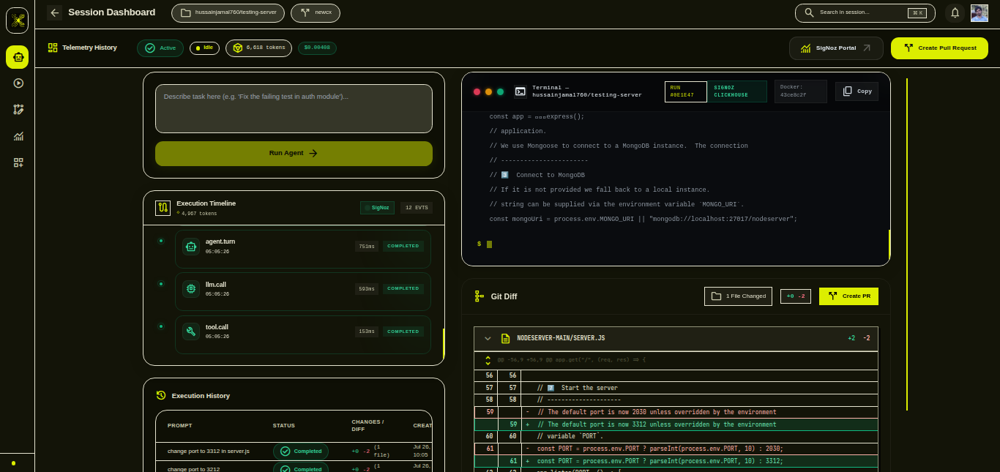
*The central command hub where you can watch the AI agent ingest GitHub issues, plan its reasoning, and stream execution steps live. It cleanly segregates planning from action.*

### 2. Live Flight Recorder (Observer)
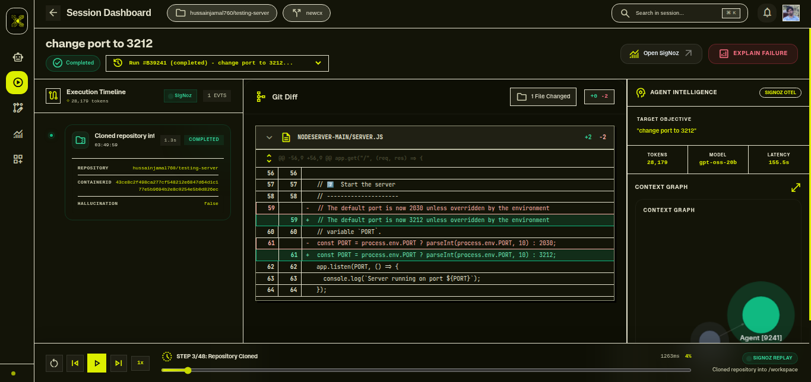
*A frame-by-frame live observer that captures every bash command, file diff, and network request executed inside the Docker Sandbox. Nothing is hidden.*

### 3. OpenTelemetry Trace Trees
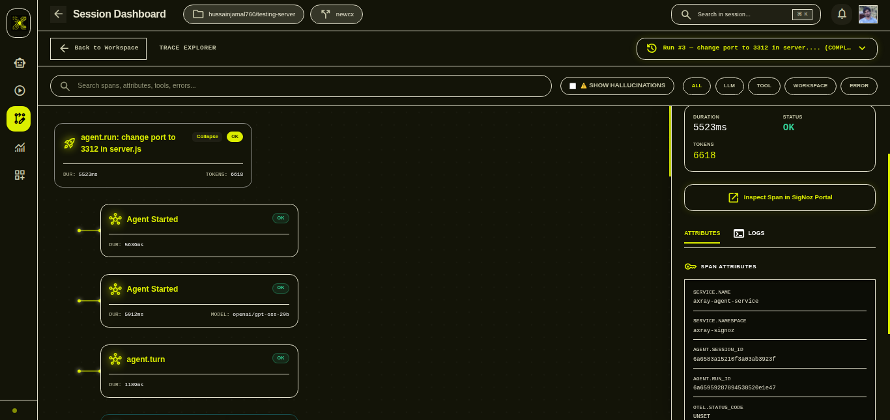
*Full OpenTelemetry trace visualization. Dive deep into the specific tokens used, exit codes, and LLM latency for every single tool invocation.*

### 4. Code & Execution Analysis
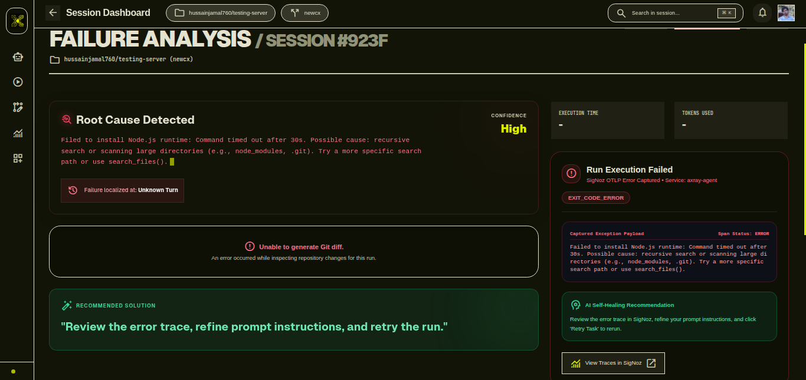
*Granular breakdown of the execution phase. Understand exactly how much "Time-in-Brain" (reasoning) vs "Time-in-Environment" (executing) the agent spent.*

### 5. SigNoz Alerts & Embedded Analytics
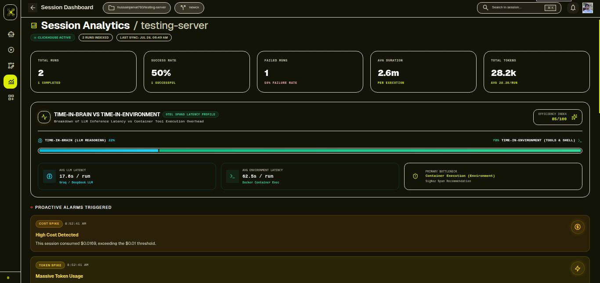
<br/>
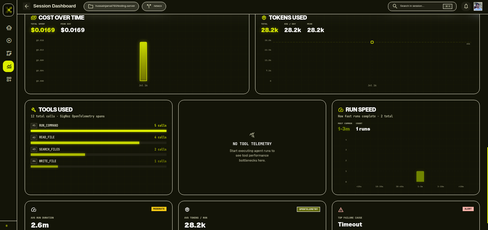
*Embedded SigNoz dashboards powered by the SigNoz MCP server. Get live alerts on token anomalies, cost spikes, and system execution failures directly within AXRAY.*

---

## 🎥 Demo Video

Watch the live session run, real-time OpenTelemetry trace tree generation, and SigNoz integration below.

<video src="https://raw.githubusercontent.com/hussainjamal760/axray-signoz/main/apps/web/public/demo.mp4" controls="controls" width="100%"></video>

*If the video above doesn't play, you can [**watch the 60-second demo here**](https://github.com/hussainjamal760/axray-signoz/blob/main/apps/web/public/demo.mp4).*

---

## 🤖 The Autonomous AI Developer Workflow

AXRAY operates as a fully autonomous CLI developer backed by OpenTelemetry observability:

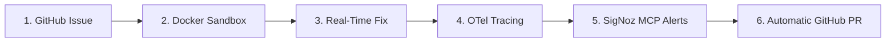

1. **🐙 GitHub Ingestion:** Ingests repository branches, issues, and prompt requirements.
2. **🔒 Docker Execution Sandbox:** Spawns isolated, non-root containers with automatic command sanitization (`grep`, `rg` exclusions).
3. **⚡ Autonomous Code Resolution:** LLM agent inspects code, runs unit tests, refactors files, and verifies execution.
4. **🛰️ OpenTelemetry Instrumentation:** Exports structured OTLP gRPC/HTTP trace trees directly to SigNoz.
5. **🔔 SigNoz MCP Alerts & Slack Integration:** Surfaces active monitor rules and routes real-time alarms to Slack channels.
6. **🚀 Automatic Pull Request Creation:** Pushes topic branches and opens GitHub PRs with markdown summaries automatically.

---

## ⚡ The Hero Feature: "Time-in-Brain" vs "Time-in-Environment"

Agents spend time in two distinct phases:
1. **Time-in-Brain (LLM Reasoning):** Time spent generating tokens and evaluating prompt contexts.
2. **Time-in-Environment (System Execution):** Time spent running bash commands, installing packages, and reading files inside Docker.

### Latency Segregation & Efficiency Scoring Formula

$$\text{Total Latency } (T_{\text{total}}) = T_{\text{Brain}} + T_{\text{Env}}$$

$$\text{Efficiency Score} = \max\left(45, \min\left(98, 100 - (0.35 \times \text{Brain \%} + 0.10 \times \text{Env \%})\right)\right)$$

```mermaid
gantt
    title Agent Turn Latency Breakdown
    dateFormat X
    axisFormat %s ms

    section LLM Inference (Brain)
    Groq LLM Reasoning Stream :active, brain1, 0, 2450

    section Container Execution (Environment)
    Docker Exec - search_files :crit, env1, 2450, 2750
    Docker Exec - write_file   :crit, env2, 2750, 2900
    Docker Exec - git diff     :crit, env3, 2900, 3130
```

---

## 🚨 SigNoz Alerts & Embedded Dashboard

AXRAY features a dual-layer SigNoz integration: **Live MCP Alert Synchronization** and an **Embedded SigNoz Dashboard**.

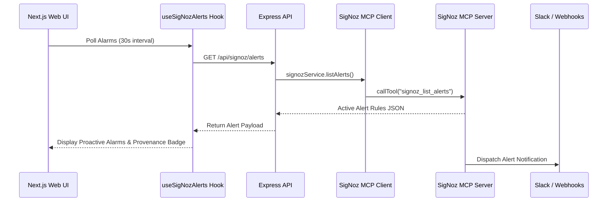

### 1. 🔔 MCP Alert Streaming & Proactive Alarms
- Connects to SigNoz using `@modelcontextprotocol/sdk` and `StreamableHTTPClientTransport`.
- Invokes `signoz_list_alerts` and `signoz_execute_builder_query` to surface live alerts and custom metrics inside the AXRAY UI.
- Combines SigNoz rules with dynamic anomaly detectors (*Cost Spike > $0.01*, *Token Spike > 10,000*).

### 2. 📊 Embedded Glassmorphic Dashboard
- Embeds your self-hosted SigNoz portal (`http://localhost:8080/dashboards`) directly inside the session workspace iframe at `/sessions/[id]/signoz`.

---

## 🏗️ System Architecture

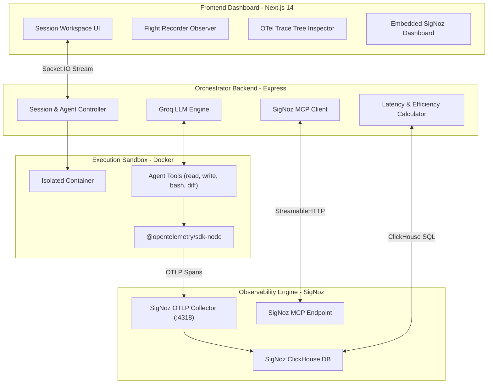

---

## 🗺️ Guided Architecture & Code Tour

- 🐙 **Session & Socket Handshake:** [SessionHeader.tsx](apps/web/features/sessions/components/SessionHeader.tsx) & [socket.emitter.ts](apps/server/src/sockets/socket.emitter.ts)
- 🔒 **Docker Container Sandbox & Command Sanitizer:** [container.service.ts](apps/server/src/services/container.service.ts)
- ⚡ **LLM Function Calling Engine:** [agent.service.ts](apps/server/src/services/agent.service.ts)
- 🛰️ **OpenTelemetry OTLP Instrumenter:** [telemetry.ts](apps/server/src/lib/telemetry.ts)
- 🔔 **SigNoz MCP Service:** [signoz.service.ts](apps/server/src/services/signoz.service.ts) & [useSigNozAlerts.ts](apps/web/features/sessions/hooks/useSigNozAlerts.ts)
- 📊 **ClickHouse Trace Timeline:** [signoz-timeline.service.ts](apps/server/src/services/signoz-timeline.service.ts)
- 🚀 **Automated GitHub PR Creation:** [github-pr.service.ts](apps/server/src/services/github-pr.service.ts)

---

## 🛡️ OpenTelemetry GenAI Semantic Conventions

| Attribute Key | Type | Example Value | Description |
| :--- | :--- | :--- | :--- |
| `axray.session.id` | `string` | `"sess_9f82a1b3"` | Correlates all runs under a session |
| `axray.run.id` | `string` | `"run_42"` | Task execution ID |
| `gen_ai.system` | `string` | `"groq"` | Target LLM provider |
| `gen_ai.request.model` | `string` | `"openai/gpt-oss-20b"` | Model identifier |
| `gen_ai.usage.input_tokens` | `int` | `14200` | Prompt token count |
| `gen_ai.usage.output_tokens`| `int` | `850` | Completion token count |
| `axray.tool.name` | `string` | `"search_files"` | Invoked tool function |
| `axray.tool.exit_code` | `int` | `0` | Container process exit code |

---

# 🚀 AXRAY — Quickstart Guide

---

## 🧪 For Judges: Zero-Setup Local Reproduction

This is the officially supported flow for reproducing this project. It requires
only **Docker** and **Foundry** (SigNoz's official CLI) — no manual database setup,
no cloud accounts, and only one config value to fill in (your Groq API key).

### Prerequisites

- [Docker Desktop](https://www.docker.com/products/docker-desktop/) installed and
  running (at least 4GB RAM allocated to Docker)
- [Foundry CLI (`foundryctl`)](https://github.com/SigNoz/foundry) installed —
  see the [Foundry quickstart](https://signoz.io/docs/install/docker/) for your OS

### Step 1 — Clone the repo

```bash
git clone https://github.com/hussainjamal760/axray-signoz.git
cd axray-signoz
```

### Step 2 — Deploy SigNoz + MCP Server (via Foundry)

```bash
cd deploy
foundryctl cast -f casting.yaml
```

> **Note:** the first run pulls several large Docker images and may take a few
> minutes. Subsequent runs are much faster since images are cached.

Once complete, confirm SigNoz is up:

- **SigNoz UI:** [http://localhost:8080](http://localhost:8080)

### Step 3 — Configure your API key

```bash
cd ..
cp .env.example .env
```

Open `.env` and set your Groq API key:

```env
GROQ_API_KEY=gsk_your_groq_api_key_here
```

Everything else in `.env` is pre-configured with sensible defaults for this
containerized flow (local MongoDB, container-network SigNoz endpoints) — no
other changes needed.

### Step 4 — Launch AXRAY

```bash
docker compose up -d
```

This starts three containers — the AXRAY backend, the AXRAY frontend, and a
local MongoDB instance — all joined to the same Docker network SigNoz created
in Step 2.


### Step 5 — Open AXRAY

- 📱 **AXRAY Dashboard:** [http://localhost:3000](http://localhost:3000)
- ⚙️ **AXRAY API:** [http://localhost:3001](http://localhost:3001)
- 📊 **SigNoz UI:** [http://localhost:8080](http://localhost:8080)

Create a session, run a prompt, and watch real-time traces, logs, and metrics
flow into SigNoz — including our pre-attached Groq dashboard and alert rules —
as the agent works.

### Verifying it's real, live telemetry

Once a session run completes:

1. Open [http://localhost:8080/traces](http://localhost:8080/traces)
2. Filter by `service.name = axray-agent`
3. You'll see live OpenTelemetry trace trees for every LLM request, tool call,
   and workspace operation from the run you just triggered

### Stopping everything

```bash
docker compose down
cd deploy/pours/deployment && docker compose down
```

> **Note:** if you're running AXRAY outside Docker for local development
> instead of the containerized flow above, use `pnpm install && pnpm dev`
> from the repo root after Step 3 (skip Step 4).

---

## 🔮 Current Scope & Future Enhancements

- **Dynamic Efficiency Heuristics:** The current Efficiency Score formula acts as a robust baseline heuristic. We plan to introduce data-driven weight adjustments by analyzing thousands of future sessions to further refine latency scoring.
- **Foundry-Optimized Metadata Sync:** Our automated dashboard synchronization is hyper-optimized for the official Foundry-deployed SigNoz (`v0.13x`). Using custom or older SigNoz deployments may require minor connection string adjustments.
- **Production-Grade OS Support:** The architecture is battle-tested on macOS and Linux (Unix environments). Windows developers are fully supported via WSL 2, ensuring seamless compatibility with ClickHouse container networking.

---

<div align="center">

### 🤝 Built by Team Cipher for the WeMakeDevs × SigNoz "Agents of SigNoz" Hackathon

*Developed with ❤️ by **Team Cipher***

</div>